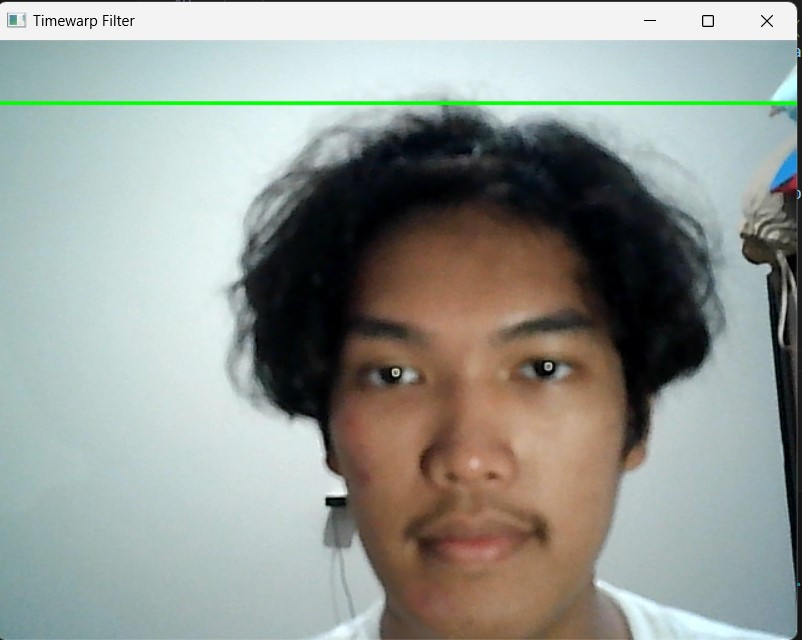
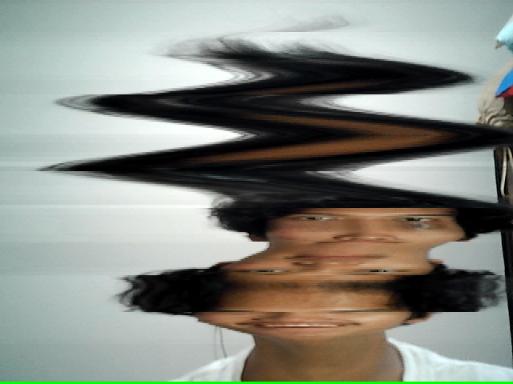

# **IF4021 Timewarp Filter**

---

| No | Nama                | NIM        |  Username  |
|----|---------------------|------------|------------|
| 1  | Andreas Pascalis | 121140017   | AndreasPascalis017 |
| 2  | Adriel Gideon Benedict| 121140196  |   121140196-Adriel       |
| 3  | Natanael Argajova    | 121140205 | Natanargajov  |

---

## **Deskripsi**
proyek filter ini bekerja dengan mendistorsi video sehingga pengguna dapat memanipulasi hasil dari sebuah video. Filter bekerja dengan menampilkan sebuah garis pada layar  dan apapun yang dilewati garis akan terdistorsi sehingga sehingga user dapat menggunakan kreatifitas mereka untuk menghasilkan beragam video unik.

---

## Fitur 
1. Penggabungan Real-Time
2. Menggabungkan frame baru dan lama untuk menciptakan efek distorsi visual yang unik.
Efek Garis Distorsi
3. Menampilkan garis hijau bergerak yang menandai bagian distorsi aktif pada frame.
Penyimpanan Output
4. Menyimpan hasil efek ke dalam file gambar dengan format .png.

---
## **Instuksi Instalasi**
1. Siapkan code editor pilihan (kami menggunakan VSCode)
2. install python (kami menggunakan versi 3.10.5)
3. clone repositori
    ```bash
    git clone https://github.com/AndreasPascalis017/IF4021_timewarp_filter.git
    cd IF4021_timewarp_filter.git
    ```
4. install file dependency 
    ```
    pip install -r requirements.txt
    ```
5. Setelah semua file terintstall run program pada file main.py
---

## **Library yang dibutuhkan**
1. opencv-python==4.10.0.84

---

## **Dokumentasi Hasil**

### 1. Hasil sebelum distorsi.


### 2. Hasil akhir distorsi


---
## **Logbook**
|NO| Tanggal | Deskripsi|
|--|---------|----------|
|1 | 05 Desember 2024 | Membuat repositori dan README.md|
|2 | 11 Desember 2024 | Update file README.md |
|3 | 12 Desember 2024 | menyicil lapporan |
|4 | 14 Desember 2024 | Input koding versi kasar |
|5 | 17 Desember 2024 | Menyusun clean code |
|6 | 20 Desember 2024 | Push dan Update clean code |
|7 | 21 Desember 2024 | Menyelesaikan laporan, membuat requirements.txt, penyelesaian program, dan push main program, perapihan README.md|
                 
---
